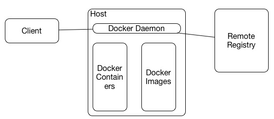
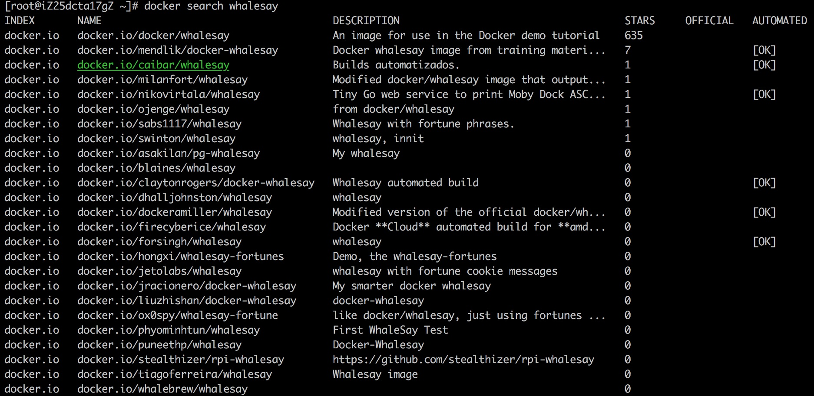
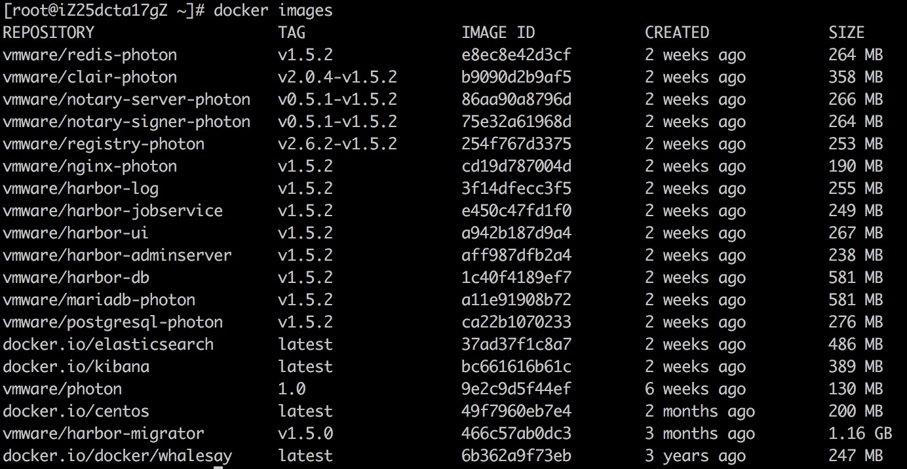

# docker 小结
---
## docker 架构

docker 整体的管理是围绕着容器和镜像进行的。镜像可以理解为放有应用的磁盘，类似于虚拟机管理中的镜像盘，而容器则是镜像运行起来以后的实例。

docker 应用繁多，一个用户不可能自己维护所有的应用镜像，因此 docker 提供了一套类似于 git 的镜像管理体系，它由远程仓库和本地仓库组成，并提供了一套类似于 git 的本地和远程仓库同步的机制。对于远程仓库，可以是官方的 hub.docker.com，也可以是用户的私有镜像仓库。

在宿主机上，用户可以通过 docker 客户端与 docker daemon 进行交互，从而实现对容器和镜像的管理

## 镜像管理
### 镜像分层存储
docker 镜像存储上是一个分层结构，举个简单例子，我们要创建一个 nginx 镜像，这个 nginx 运行在 centos 上。如果我们从头开始，就需要创建 centos，再在这个 centos 基础上去安装 nginx，这个是一个很复杂的过程。因此 docker 在管理上，提供了一些基础镜像，如 centos，用户只需要在这个基础上安装 nginx，并提交为 nginx 镜像，这样就创建了一个用户自己的 nginx。

这里 centos 就是一层，而用户构建的 nginx 是另一层，这样的好处，一个是降低了用户构建镜像的复杂度，另一方面，如果两个镜像都使用共同的基础镜像，该基础镜像在宿主机上只需要存储一份，可以降低存储空间，同时也降低了本地镜像和远程仓库同步的开销。

构建用户自己的镜像树，是做好镜像管理的第一步。

### 镜像基本管理

- docker login [server]

	登录远程镜像服务器，拉取私有镜像，像远程镜像服务器推送镜像，均要有相应的权限，因此在做这些操作时，需要先进行 login 操作。未指定远程服务器名字时，默认使用都是 docker.io 镜像仓库，该仓库是 docker 官方仓库，可以在 hub.docker.com 上进行注册

- docker search image

	在 docker.io 中搜索镜像

	

- docker pull IMAGE[:TAG|@DIGEST]

	从远程进行仓库拉取一个镜像，这里的 IMAGE，完整格式是 server/user/name，如上面 search 结果中的 docker.io/docker/whalesay，server 是 docker.io，user 是 docker，name 是 whalesay。

	不指定 server，默认为 docker.io，不指定 user，默认 user 级别为空，拉取镜像为 docker.io/name。我们可以使用两种拉取方式拉取 docker.io/docker/whalesay

		docker pull docker.io/docker/whalesay
		docker pull docker/whalesay

	对于镜像还有两个比较重要的属性就是 TAG 和 DIGEST，这两个和 git 中的项目是类似的。Tag 是为进行打的标签，一般用作镜像版本管理，如果不指定，默认为 latest，即最新版本。Digest 是镜像的提交号，相当于 git 中的 commit

- docker images

	查看本地镜像

	

- docker rmi IMAGE

	删除本地镜像

- docker push IMAGE[:TAG]

	将本地镜像推送到远程仓库，后面会在镜像构建中进行介绍

- docker inspect IMAGE

	查看执行镜像的详细信息，docker inspect 不仅可以查看镜像的详细信息，也可以查看容器的详细信息

## 容器管理
- docker ps

	查看容器，docker ps 查看当前正在运行的容器，docker ps -a 查看所有的容器(包含已经结束的容器)

- docker run IMAGE [COMMAND] [ARG...]

	使用指定镜像创建一个容器并运行，如果指定镜像不在本地，docker 会使用 docker pull 从远程镜像仓库拉取该镜像。docker run 还有很多参数，具体可以使用 docker run --help 查看

	对于 docker run 还有一个重要参数是 --rm，指定该参数后，当容器退出后会删除该容器

- docker exec -it CONTAINER COMMAND [ARG...]

	该命令有其它参数，但是我们常用的是 -i -t，简写为 -it，一般使用该命令介入到正在运行的容器中执行某个命令。如 docker exec -it /bin/bash，可以接入到某个以 Linux 为基础运行的容器的 shell 中

- docker cp

	在宿主机和容器间拷贝文件

- docker rm CONTAINER

	删除容器

## 镜像构建
### 使用容器方式
docker 可以将正在运行的容器，提交为镜像，使用命令为：

	docker commit CONTAINER [REPOSITORY[:TAG]]

以下为使用 centos 作为基础镜像，创建一个 nginx 镜像的过程：

1. 启动一个 centos 容器，并登入 Bash

		docker run -it centos /bin/bash

2. 使用 yum 安装 nginx

		rpm -Uvh http://nginx.org/packages/centos/7/noarch/RPMS/nginx-release-centos-7-0.el7.ngx.noarch.rpm
		yum install -y nginx

3. 退出容器

		exit

4. 查看安装了 nginx 的容器

		docker ps -a |grep centos
		76018fa3b809        centos                                 "/bin/bash"              7 minutes ago       Exited (0) 28 seconds ago                                                                         friendly_bhabha

	可以看到刚才安装 nginx 的容器 ID 为 76018fa3b809

5. 使用容器生成镜像

		docker commit 76018fa3b809 alexwoo/nginx
		docker images |grep alexwoo
		alexwoo/nginx                 latest              3a849d9e1448        36 seconds ago      374 MB

	可以看到本地镜像中有一个 alexwoo/nginx 镜像，版本为 latest

6. 使用新镜像创建 nginx 容器

		docker run -p 80:80 alexwoo/nginx nginx -g 'daemon off;'
	
	这里使用前台启动的方式启动 nginx，并将外部的 80 端口映射到容器中的 80 端口。此时使用浏览器或 curl 命令可以得到 nginx 的输出结果

7. 将镜像推送到远程仓库

		docker push alexwoo/nginx

	推送前需要使用 docker login 登录远程仓库

### 使用 dockerfile
以上方式适合对镜像进行微调，一般情况下更建议使用 dockerfile 来生成镜像

	mkdir nginx && cd nginx
	vi Dockerfile
	docker build -t alexwoo/nginx ./

第二步中 Dockerfile 内容

	FROM centos
	MAINTAINER alexwoo
	RUN  rpm -Uvh http://nginx.org/packages/centos/7/noarch/RPMS/nginx-release-centos-7-0.el7.ngx.noarch.rpm
	RUN  yum install -y nginx
	EXPOSE 80/tcp
	CMD ["nginx", "-g", "daemon off;"]

以上完成镜像创建后，可以使用，启动容器：

	docker run alexwoo/nginx

上例中，我们指定了 FROM 作为构建镜像的基础镜像，使用 EXPOSE 指定了镜像对外暴露的 TCP 端口，指定了镜像默认运行命令为 nginx -g 'daemon off;'

## Dockerfile

Dockerfile 可用于构建一个基础镜像，其结构可以分为 4 个部分：

- 指定基础镜像
- 指定镜像作者
- 构建镜像过程
- 运行环境指定
- 镜像启动命令

### 指定基础镜像

	FROM <image>[:<tag>|@<digest>] [AS <name>]

### 指定镜像作者

	MAINTAINER <name>
	
这一步是可以省略的

### 构建镜像的过程

- 执行一条命令

		RUN <command>

- 拷贝文件到指定目录

		ADD [--chown=<user>:<group>] <src>... <dest>
		COPY [--chown=<user>:<group>] <src>... <dest>

	ADD 支持从指定 URL 下载文件，COPY 只支持本地文件

### 运行环境指定

	WORKDIR /path/to/workdir

WORKDIR 指定了镜像中 RUN，CMD，ENTRYPOINT，ADD 和 COPY 的默认执行路径

	VOLUME ["/data"]
	
VOLUME 指定挂载卷，但是不能指定映射到宿主机的目录

	EXPOSE <port> [<port>/<protocol>...]

EXPOSE 指定对外暴露的端口

	ENV <key> <value>
	ENV <key>=<value> ...

ENV 指定容器对外暴露的环境变量

### 镜像启动命令

指定了镜像启动命令，docker run 可以省略后面 COMMAND 部分

	CMD ["executable","param1","param2"] (exec form, this is the preferred form)
	CMD ["param1","param2"] (as default parameters to ENTRYPOINT)
	CMD command param1 param2 (shell form)

	ENTRYPOINT ["executable", "param1", "param2"] (exec form, preferred)
	ENTRYPOINT command param1 param2 (shell form)

CMD 只能存在一条，如果指定了多条，以最后一条为准，ENTRYPOINT 和 CMD 同时存在时，以 ENTRYPOINT 指定内容为执行程序，以 CMD 指定内容为执行程序参数