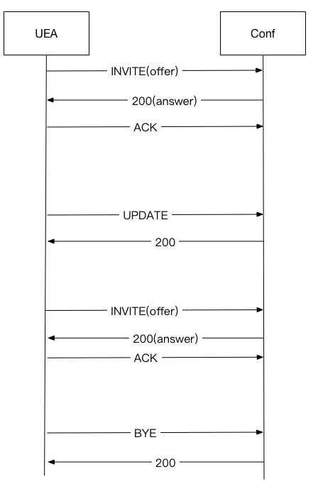
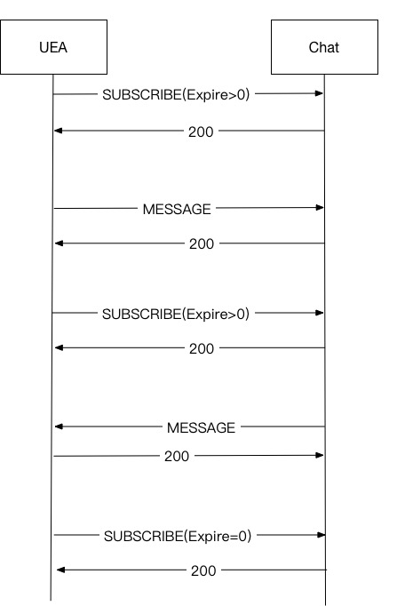

# JSIP 信令基础规范
---

## 基本规范

JSIP 即 SIP 协议使用 JSON 打包，这里提供一个简版介绍，目的为规范实时互动业务信令。JSIP 可以使用 websocket 通道进行传输，也可以使用 UDP 通道进行传输，类似于 SIP 协议使用 TCP 和 UDP 两种方式进行承载。推荐使用 JSIP over websocket，因为目前绝大多数 HTTP 框架都支持 websocket，JSON 也是一种便于多种语言操作的语言。

### 请求

	{
		"Type":"INVITE",
		"Request-URI":"room:888@rtc.test.com",
		"From":"Alex@rtc.test.com",
		"To":"room:888@rtc.test.com",
		"DialogueID":"1f2b38472f596d72",
		"CSeq":1,
		"Expire":300,
		"P-Asserted-Identity":"6666@rtc.test.com",
		"Content-Type":"sdp",
		"Content-Length":1000,
		"Body":".....",
	}

### 响应

	{
	 	"Type":"RESPONSE",
	 	"Code":200,
	 	"Desc":"OK",
	 	"From":"Alex@rtc.test.com",
		"To":"room:888@rtc.test.com",
		"DialogueID":"1f2b38472f596d72",
		"CSeq":1,
	 	"P-Asserted-Identity":"8888@rtc.test.com",
		"Content-Type":"sdp",
		"Content-Length":800,
		"Body":".....",
	}

### 必选头

- Type：消息类型，响应统一为 RESPONSE，请求与 SIP 协议定义相同，如 INVITE，SUBSCRIBE，MESSAGE 等
- Request-URI：请求消息必选，请求 URI
- Code：响应消息必选，定义与 SIP 协议一致，100-199 为临时响应，200-299 为成功响应，300-399 为跳转响应，400-499 为客户端错误，500-599 为服务端错误，600-699 为全局错误。大于 200 为最终响应，一个请求可以有多个临时响应加一个最终响应
- Desc：响应消息必选，对响应的描述
- From：用户昵称
- To：一般与 Request-URI 一致，如果 Request-URI 发生修改，尽量不要改 To
- DialogueID：对话号，标识一路会话，相当于 SIP 协议中的 Call-ID + From-Tag + To-Tag
- CSeq：请求序列，一般在同一个会话下，不同的请求需要有不同的 CSeq，响应使用该 CSeq 与请求关联。CANCEL 特殊，CANCEL 的 CSeq 与其 Cancel 请求的 CSeq
- Content-Length：消息体长度，如果没有消息体，填为 0

### 其它重要的头

- Expire：存在需要刷新的信令中，单位秒，表示指定时间内不刷新，需要更新状态
- P-Asserted-Identity：用户唯一身份识别 ID，与 From 对应，PAI 类似于 QQ 号，From 类似于 QQ 昵称
- Content-Type：消息类似，如 sdp，text 等

### ID

- 用户 ID

	用户身份唯一识别标识，格式为：字符串@域，如 8888@rtc.test.com，rtc.test.com 为业务提供方的域，8888 为业务提供方为其用户分配的唯一身份标识

- 用户昵称

	用户显示的昵称，格式为 字符串@域，如 Alex@rtc.test.com

- 会议室 ID

	会议室标识，格式为 room:字符串@域

- 设备域名

	对每个设备会分配一个设备域名，如 as1.vendor.com

### 请求

#### INVITE

会话邀请，用于建立一个音视频会话。如果会话已经建立，INVITE 用于媒体更新，如 SFU 中有新用户加入，媒体属性发生改变等。INVITE 为三次握手，这里暂不引入可靠临时响应等 SIP 协议特性，在会议系统中，用户主动连接会议服务器，不使用临时响应，流程一般为 INVITE,200,ACK，offer answer 使用两种方式携带：INVITE 中携带 offer，200 中携带 answer；200 中携带 offer，ACK 中携带 answer

初始 INVITE 中需要携带 Expire，值大于 0，表示会话建立以后，保活刷新的时间，保活刷新一般为 Expire 时间的一般，如 Expire 为 200，则每 100s 发送一次保活刷新。保活刷新使用 UPDATE

#### ACK

在 INVITE 会话中，对最终响应，均需要一个 ACK 进行确认，ACK 不需要响应确认

#### CANCEL

客户端向服务端发起请求时，如果服务端不回送响应，客户端可以使用 CANCEL 取消该请求

#### UPDATE

UPDATE 在临时响应阶段用于更新媒体，这个流程中 UPDATE 和其 200 响应需要携带 offer 和 answer。在会话建立以后，用于保活链路刷新，此时不需要携带 SDP

#### BYE

用于拆除 INVITE 建立的会话，需要有 200 响应，可以是主叫方拆除，也可以是被叫方拆除

#### SUBSCRIBE

订阅请求，目前只考虑在聊天时流程中，用户注册在聊天室使用。需要填写 Expire 头，大于 0 表示加入聊天室，并且需要在 Expire 到期前进行刷新，以保证用户不会被聊天室踢出。等于 0 表示用户退出聊天室。需要填写 Event 头，内容为 Message-push，表示订阅消息推送

#### MESSAGE

短消息，在必达消息中，如果消息确认发到了终端，向请求方回送 200 OK，如果消息未发送成功，需保存消息，并向请求方发送 202 Accepted，在聊天室流程中，MESSAGE 的 Dialogue 需要与 SUBSCRIBE 中的 Dialogue 保持一致，点对点消息则使用独立的 Dialogue

#### REGISTER

用户注册，需要填写 Expire 头，大于 0 表示用户注册，并且需要在 Expire 到期前进行刷新，以保证用户注册状态，等于 0 表示注销

## 流程

#### 音视频会话

1. INVITE

		{
			"Type":"INVITE",
			"Request-URI":"room:888@rtc.test.com",
			"From":"Alex@rtc.test.com",
			"To":"room:888@rtc.test.com",
			"DialogueID":"1f2b38472f596d72",
			"CSeq":1,
			"Expire":300,
			"P-Asserted-Identity":"6666@rtc.test.com",
			"Content-Type":"sdp",
			"Content-Length":1000,
			"Body":".....",
		}

2. 200(INVITE)

		{
		 	"Type":"RESPONSE",
		 	"Code":200,
		 	"Desc":"OK",
		 	"From":"Alex@rtc.test.com",
			"To":"room:888@rtc.test.com",
			"DialogueID":"1f2b38472f596d72",
			"CSeq":1,
		 	"P-Asserted-Identity":"8888@rtc.test.com",
			"Content-Type":"sdp",
			"Content-Length":800,
			"Body":".....",
		}

3. ACK

		{
			"Type":"ACK",
			"Request-URI":"room:888@rtc.test.com",
			"From":"Alex@rtc.test.com",
			"To":"room:888@rtc.test.com",
			"DialogueID":"1f2b38472f596d72",
			"CSeq":2,
			"Content-Length":0,
		}

	此处 Request-URI，From，To 中的值均无意义

4. UPDATE

		{
			"Type":"UPDATE",
			"Request-URI":"room:888@rtc.test.com",
			"From":"Alex@rtc.test.com",
			"To":"room:888@rtc.test.com",
			"DialogueID":"1f2b38472f596d72",
			"CSeq":3,
			"Content-Length":0,
		}

	此处 Request-URI，From，To 中的值均无意义

5. 200(UPDATE)

		{
		 	"Type":"RESPONSE",
		 	"Code":200,
		 	"Desc":"OK",
		 	"From":"Alex@rtc.test.com",
			"To":"room:888@rtc.test.com",
			"DialogueID":"1f2b38472f596d72",
			"CSeq":4,
			"Content-Length":0,
		}

6. INVITE

		{
			"Type":"INVITE",
			"Request-URI":"room:888@rtc.test.com",
			"From":"Alex@rtc.test.com",
			"To":"room:888@rtc.test.com",
			"DialogueID":"1f2b38472f596d72",
			"CSeq":5,
			"Expire":300,
			"P-Asserted-Identity":"6666@rtc.test.com",
			"Content-Type":"sdp",
			"Content-Length":1000,
			"Body":".....",
		}

7. 200(INVITE)

		{
		 	"Type":"RESPONSE",
		 	"Code":200,
		 	"Desc":"OK",
		 	"From":"Alex@rtc.test.com",
			"To":"room:888@rtc.test.com",
			"DialogueID":"1f2b38472f596d72",
			"CSeq":5,
		 	"P-Asserted-Identity":"8888@rtc.test.com",
			"Content-Type":"sdp",
			"Content-Length":800,
			"Body":".....",
		}

8. ACK

		{
			"Type":"ACK",
			"Request-URI":"room:888@rtc.test.com",
			"From":"Alex@rtc.test.com",
			"To":"room:888@rtc.test.com",
			"DialogueID":"1f2b38472f596d72",
			"CSeq":6,
			"Content-Length":0,
		}

9. BYE

		{
			"Type":"BYE",
			"Request-URI":"room:888@rtc.test.com",
			"From":"Alex@rtc.test.com",
			"To":"room:888@rtc.test.com",
			"DialogueID":"1f2b38472f596d72",
			"CSeq":7,
			"Content-Length":0,
		}

	此处 Request-URI，From，To 中的值均无意义

10. 200(BYE)

		{
		 	"Type":"RESPONSE",
		 	"Code":200,
		 	"Desc":"OK",
		 	"From":"Alex@rtc.test.com",
			"To":"room:888@rtc.test.com",
			"DialogueID":"1f2b38472f596d72",
			"CSeq":7,
			"Content-Length":0,
		}

#### 聊天室

1. SUBSCRIBE

		{
			"Type":"SUBSCRIBE",
			"Request-URI":"room:888@rtc.test.com",
			"From":"Alex@rtc.test.com",
			"To":"room:888@rtc.test.com",
			"DialogueID":"1f2b38472f596d72",
			"CSeq":1,
			"Expire":300,
			"P-Asserted-Identity":"6666@rtc.test.com",
			"Content-Length":0,
		}

2. 200(INVITE)

		{
		 	"Type":"RESPONSE",
		 	"Code":200,
		 	"Desc":"OK",
		 	"From":"Alex@rtc.test.com",
			"To":"room:888@rtc.test.com",
			"DialogueID":"1f2b38472f596d72",
			"CSeq":1,
		 	"P-Asserted-Identity":"8888@rtc.test.com",
			"Content-Length":0,
		}

3. MESSAGE

		{
			"Type":"MESSAGE",
			"Request-URI":"room:888@rtc.test.com",
			"From":"Alex@rtc.test.com",
			"To":"room:888@rtc.test.com",
			"DialogueID":"1f2b38472f596d72",
			"CSeq":2,
			"Expire":300,
			"P-Asserted-Identity":"6666@rtc.test.com",
			"Content-Length":70,
			"Content-Type":"text",
			"Body":"..."
		}

4. 200(INVITE)

		{
		 	"Type":"RESPONSE",
		 	"Code":200,
		 	"Desc":"OK",
		 	"From":"Alex@rtc.test.com",
			"To":"room:888@rtc.test.com",
			"DialogueID":"1f2b38472f596d72",
			"CSeq":2,
		 	"P-Asserted-Identity":"8888@rtc.test.com",
			"Content-Length":0,
		}

5. SUBSCRIBE

		{
			"Type":"SUBSCRIBE",
			"Request-URI":"room:888@rtc.test.com",
			"From":"Alex@rtc.test.com",
			"To":"room:888@rtc.test.com",
			"DialogueID":"1f2b38472f596d72",
			"CSeq":3,
			"Expire":300,
			"P-Asserted-Identity":"6666@rtc.test.com",
			"Content-Length":0,
		}

6. 200(INVITE)

		{
		 	"Type":"RESPONSE",
		 	"Code":200,
		 	"Desc":"OK",
		 	"From":"Alex@rtc.test.com",
			"To":"room:888@rtc.test.com",
			"DialogueID":"1f2b38472f596d72",
			"CSeq":3,
		 	"P-Asserted-Identity":"8888@rtc.test.com",
			"Content-Length":0,
		}

7. MESSAGE

		{
			"Type":"MESSAGE",
			"Request-URI":"8888@rtc.test.com",
			"From":"Bob@rtc.test.com",
			"To":"room:888@rtc.test.com",
			"DialogueID":"1f2b38472f596d72",
			"CSeq":4,
			"Expire":300,
			"P-Asserted-Identity":"5555@rtc.test.com",
			"Content-Length":70,
			"Content-Type":"text",
			"Body":"..."
		}

	聊天室向终端用户下发消息时，Request-URI 变换为实际用户的用户 ID，From 保持为消息发送方的昵称，To 保持为会议室 ID

8. 200(INVITE)

		{
		 	"Type":"RESPONSE",
		 	"Code":200,
		 	"Desc":"OK",
		 	"From":"Alex@rtc.test.com",
			"To":"room:888@rtc.test.com",
			"DialogueID":"1f2b38472f596d72",
			"CSeq":4,
		 	"P-Asserted-Identity":"5555@rtc.test.com",
			"Content-Length":0,
		}

9. SUBSCRIBE

		{
			"Type":"SUBSCRIBE",
			"Request-URI":"room:888@rtc.test.com",
			"From":"Alex@rtc.test.com",
			"To":"room:888@rtc.test.com",
			"DialogueID":"1f2b38472f596d72",
			"CSeq":5,
			"Expire":0,
			"P-Asserted-Identity":"6666@rtc.test.com",
			"Content-Length":0,
		}

10. 200(INVITE)

		{
		 	"Type":"RESPONSE",
		 	"Code":200,
		 	"Desc":"OK",
		 	"From":"Alex@rtc.test.com",
			"To":"room:888@rtc.test.com",
			"DialogueID":"1f2b38472f596d72",
			"CSeq":5,
		 	"P-Asserted-Identity":"8888@rtc.test.com",
			"Content-Length":0,
		}